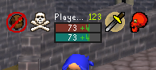
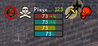
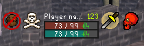
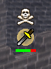
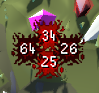
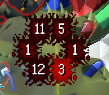
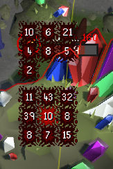

# Nameplates

Adds customizable nameplates and hitsplats to the game.

## Nameplates

This plugin adds extensively customizable nameplates over the top of players and NPCs, which replace the original UI elements (health bar, overhead, skull).

You can set a different nameplate theme for each of: 
- Self
- Party members
- Other players
- NPCs

You can choose to display additional information such as:
- name
- prayer, run energy and special attack bars (of local player and party members)
- combat level
- vengeance status (of local player and party members)
- NPC no-loot indicator (for ironmen)

The plugin has 4 default themes, which can be cloned and customized to your liking, or you can create your own themes from scratch. These are the default themes:

### Flat Dark (default)

A simple, minimal, flat design with a dark background.

### Flat Dark Full Info

An extended version of Flat Dark, adding run energy and special attack bars.

### Flat Dark Extended

A wider version of Flat Dark, with the addition of max hp and pp text.

### OSRS

A recreation of the default OSRS health bar, following the same render order (health bar, overhead, skull).

## Hitsplats

In the future, this plugin will allow you to customize the appearance of hitsplats, including their size, position, images and text. But for now, you can pick between 3 pre-defined hitsplat themes:

### OSRS (default)

A recreation of the default OSRS theme, following the same render order (down, up, left, right)

### Ring

Similar to the default OSRS theme, but with a different render order (counter-clockwise) and with an extendable (up to 6 splats) circular design.

### Scrolling

A scrolling theme, where hitsplats draw in columns and rows and scroll upwards, this theme currently allows for the display of up to 18 hitsplats at once (9 this tick, 9 last tick).

Check out the Github issues: https://github.com/Thource/rl-nameplates-and-hitsplats/issues
